# Analyse des Dépendances : setup.sh

## 📊 Vue d'ensemble

**Analyse effectuée** : 14 janvier 2026  
**Fichier** : `setup.sh` (1689 lignes, 107 fonctions)  
**Type de dépendances** : Appels de fonctions, dépendances système, ordre d'exécution

---

## 🔗 Graphe de dépendances entre fonctions

### Fonction Main() - Orchestrateur principal

La fonction `Main()` (lignes 1578-1679) est le point d'entrée qui appelle toutes les autres fonctions.

**Fonctions appelées par Main() (dans l'ordre) :**

```mermaid
graph TD
    Main[Main]
    Main --> Packages
    Main --> BootRepair
    Main --> Delta
    Main --> Dropbox
    Main --> DVD
    Main --> FlatPack
    Main --> Fuzzy
    Main --> GnomeConfigurations
    Main --> GnomeExtensions
    Main --> Hurl
    Main --> Keybase
    Main --> K3S
    Main --> Kubernetes
    Main --> lutris
    Main --> lynis
    Main --> Minishift
    Main --> mkcert
    Main --> MultiOSUSB
    Main --> Music
    Main --> nicotine
    Main --> nix
    Main --> OfflineImap
    Main --> PlayOnLinux
    Main --> Powershell
    Main --> ProtonBridge
    Main --> ProtonVPN
    Main --> Puppet
    Main --> Rust
    Main --> scrcpy
    Main --> Screensavers
    Main --> Signal
    Main --> Slack
    Main --> SNAP
    Main --> Spotify
    Main --> Stacer
    Main --> Students
    Main --> Teams
    Main --> Terminal
    Main --> TLDR
    Main --> ttfmscorefontsinstaller
    Main --> urbackup
    Main --> VIM
    Main --> VirtualBox
    Main --> Vivaldi
    Main --> VSCodium
    Main --> WakeMeOps
    Main --> WSS
    Main --> WTF
    Main --> XAuth
    Main --> YakYak
    Main --> youtube
    Main --> ZSH
```



**Fonctions commentées (désactivées dans Main) :**
- `Setup`
- `WIFI`
- `PPA`
- `Python`
- `GO`
- `Albert`
- `Android`
- `Ansible`
- `Argbash`
- `Atom`
- `Bat`
- `bcctools`
- `bluegriffon`
- `Brew`
- `browsh`
- `Chaos`
- `ChatGPT`
- `Children`
- `Chrome`
- `chromeIPass`
- `CLOUD`
- `coolretroterm`
- `CozyDrive`
- `Crontab`
- `Crowdsec`
- `Ctop`
- `Docker`
- `Douane`
- `DroidCAM`
- `Element`
- `Feedreader`
- `GCStar`
- `Github`
- `GrafTCP`
- `GRAPH`
- `Infrakit`
- `IssueHelper`
- `Lightworks`
- `lynishardening`
- `Multisystem`
- `npmfx`
- `OneDrive`
- `OSQuery`
- `rapidphotodownloader`
- `RocketChat`
- `s3benchmark`
- `Spip-Cli`
- `STui`
- `Taskfile`
- `Trello`
- `YunoHost`
- `zquests`

---

## 🔄 Dépendances entre fonctions (détectées)

### Type 1 : Dépendances directes (appels explicites)

**Aucune dépendance directe détectée** : Les fonctions dans setup.sh sont **indépendantes** et ne s'appellent pas entre elles (à l'exception de `Main()` qui les orchestre).

Cela signifie que :
- Chaque fonction peut être exécutée de manière isolée
- Pas de risque de boucle récursive
- Architecture modulaire et découplée

---

### Type 2 : Dépendances implicites (prérequis système)

Certaines fonctions ont des dépendances implicites sur d'autres :

#### 1️⃣ Kubernetes() → Docker (implicite)

```bash
# Kubernetes() suppose que Docker est installé
# Car Kubernetes s'exécute sur des conteneurs Docker
```

**Relation** : `Kubernetes()` nécessite `Docker()` (mais Docker est commenté dans Main)

**Impact** : Si Docker n'est pas installé, Kubernetes peut échouer

---

#### 2️⃣ K3S() → Docker (optionnel)

```bash
# K3S peut fonctionner sans Docker (utilise containerd)
# Mais certaines images peuvent nécessiter Docker
```

**Relation** : `K3S()` peut bénéficier de `Docker()` mais ne le requiert pas strictement

---

#### 3️⃣ Minishift() → Docker (implicite)

```bash
# Minishift nécessite Docker ou Podman
```

**Relation** : `Minishift()` requiert `Docker()` ou un runtime de conteneurs

---

#### 4️⃣ GnomeExtensions() → GnomeConfigurations() (ordre logique)

```bash
# Installer les extensions avant de les configurer
```

**Relation** : Ordre recommandé (mais pas obligatoire)

**Dans Main()** :
```bash
GnomeConfigurations  # ligne 1617
GnomeExtensions      # ligne 1618
```

**⚠️ Ordre inversé** : GnomeConfigurations est appelé **avant** GnomeExtensions, ce qui peut causer des problèmes si des configurations dépendent d'extensions non encore installées.

---

#### 5️⃣ ZSH() → Packages (implicite)

```bash
# ZSH() suppose que git et zsh sont installés
# Ces paquets sont dans Packages()
```

**Relation** : `ZSH()` dépend de `Packages()` pour avoir `git` et `zsh`

**Dans Main()** :
```bash
Packages  # ligne 1584 (commenté actuellement : #  Packages)
...
ZSH       # ligne 1677
```

**✅ Ordre correct** : Packages serait appelé avant ZSH (si décommenté)

---

#### 6️⃣ GO() → Packages (implicite)

```bash
# GO() nécessite git, wget, tar (fournis par Packages)
```

**Relation** : `GO()` dépend de `Packages()`

---

#### 7️⃣ Python() → Packages (implicite)

```bash
# Python() nécessite pip (fourni par python3-pip dans Packages)
```

**Relation** : `Python()` dépend de `Packages()`

---

#### 8️⃣ Ansible() → Python() (implicite)

```bash
Ansible() {
  # Ansible
  sudo pip install ansible ansible-lint
  # ...
}
```

**Relation** : `Ansible()` nécessite `pip` qui est configuré par `Python()`

---

#### 9️⃣ Terraform() → Packages (implicite)

```bash
# Terraform nécessite wget, unzip (fournis par Packages)
```

---

#### 🔟 VIM() → Packages (implicite)

```bash
VIM() {
  # Vundle
  git clone https://github.com/VundleVim/Vundle.vim.git ~/.vim/bundle/Vundle.vim
  # ...
}
```

**Relation** : Nécessite `git` de `Packages()`

---

## 📦 Dépendances système (externes)

### Catégorie 1 : Gestionnaires de paquets

| Fonction | Dépend de | Raison |
|----------|-----------|--------|
| Toutes les fonctions | `apt` / `apt-get` | Installation de paquets Debian/Ubuntu |
| `SNAP()` | `snapd` | Installation de paquets Snap |
| `FlatPack()` | `flatpak` | Installation de paquets Flatpak |
| `Brew()` | `Homebrew` | Installation de paquets (macOS/Linux) |
| `nix()` | `Nix` | Installation de paquets Nix |

---

### Catégorie 2 : Outils de build

| Fonction | Dépend de | Raison |
|----------|-----------|--------|
| `GO()` | `wget`, `tar`, `git` | Téléchargement et extraction Go |
| `Rust()` | `curl` | Installation rustup |
| `Docker()` | `curl`, `apt-transport-https` | Ajout du dépôt Docker |
| `Kubernetes()` | `curl`, `wget` | Téléchargement kubectl, minikube |

---

### Catégorie 3 : Outils système

| Fonction | Dépend de | Raison |
|----------|-----------|--------|
| `Setup()` | `timedatectl`, `apt` | Configuration système de base |
| `WIFI()` | `nmcli`, `systemctl` | Configuration réseau |
| `PPA()` | `apt-add-repository` | Ajout de PPA Ubuntu |

---

## 🔀 Ordre d'exécution recommandé

### Phase 1 : Configuration de base

```bash
1. Setup()              # Configuration système fondamentale
2. WIFI()               # Réseau (si nécessaire)
3. PPA()                # Dépôts supplémentaires
4. Packages()           # Paquets de base (git, curl, wget, etc.)
```

**Justification** : Ces fonctions préparent l'environnement pour toutes les autres.

---

### Phase 2 : Langages et runtimes

```bash
5. Python()             # Python et pip
6. GO()                 # Go et outils Go
7. Rust()               # Rust et cargo
```

**Justification** : De nombreux outils sont écrits en Go, Python, ou Rust.

---

### Phase 3 : Conteneurs et orchestration

```bash
8. Docker()             # Docker CE
9. K3S()                # Kubernetes léger (si pas de Docker)
10. Kubernetes()        # Minikube, kubectl
11. Minishift()         # OpenShift local
```

**Justification** : Infrastructure de conteneurs.

---

### Phase 4 : Outils de développement

```bash
12. VIM()               # Éditeur Vim avec plugins
13. Atom()              # Éditeur Atom (si utilisé)
14. VSCodium()          # VS Code sans télémétrie
15. Ansible()           # Automatisation
16. Terraform()         # Infrastructure as Code
17. Puppet()            # Configuration management
```

---

### Phase 5 : Desktop et applications

```bash
18. GnomeExtensions()   # Extensions GNOME (AVANT GnomeConfigurations)
19. GnomeConfigurations()  # Configuration GNOME
20. Terminal()          # Configuration terminal
21. ZSH()               # Shell Zsh avec Oh-My-Zsh
```

**⚠️ Ordre critique** : Installer extensions **avant** de les configurer.

---

### Phase 6 : Applications utilisateur

```bash
22. Dropbox()
23. Spotify()
24. Signal()
25. Slack()
26. Teams()
27. Element()
28. Chrome()
29. Vivaldi()
30. ...
```

---

### Phase 7 : Sécurité et monitoring

```bash
N-5. lynis()            # Audit de sécurité
N-4. Crowdsec()         # IDS/IPS
N-3. OSQuery()          # Monitoring
N-2. mkcert()           # Certificats locaux
N-1. ProtonVPN()        # VPN
```

---

## ⚠️ Problèmes détectés dans l'ordre actuel

### Problème 1 : GnomeConfigurations avant GnomeExtensions

**Code actuel (Main)** :
```bash
GnomeConfigurations  # ligne 1617
GnomeExtensions      # ligne 1618
```

**Conséquence** : Configuration d'extensions potentiellement non installées.

**Solution** : Inverser l'ordre.
```bash
GnomeExtensions      # Installer d'abord
GnomeConfigurations  # Configurer ensuite
```

---

### Problème 2 : Packages() commenté mais requis

**Code actuel (Main)** :
```bash
#  Packages  # ligne 1584 (commenté)
```

**Conséquence** : De nombreuses fonctions échoueront si `git`, `curl`, `wget` ne sont pas installés.

**Solution** : Décommenter `Packages` en premier.

---

### Problème 3 : Docker commenté mais requis par Kubernetes

**Code actuel (Main)** :
```bash
#  Docker        # Commenté
...
Kubernetes      # ligne 1624 (actif)
```

**Conséquence** : Kubernetes échouera sans Docker (minikube nécessite un runtime).

**Solution** : 
- Soit décommenter `Docker`
- Soit modifier Kubernetes pour utiliser K3S (qui n'a pas besoin de Docker)

---

### Problème 4 : Python/GO commentés mais utilisés par d'autres

**Code actuel (Main)** :
```bash
#  Python        # Commenté
#  GO            # Commenté
```

**Fonctions qui en dépendent** :
- `Ansible()` → Python/pip
- `Kubernetes()` → Go (pour certains outils)
- `Docker()` → Go (lazydocker)

---

## 🔧 Ordre d'exécution optimal recommandé

Voici l'ordre recommandé pour Main() :

```bash
Main() {
  # Phase 1 : Base système
  Setup
  WIFI
  PPA
  Packages
  
  # Phase 2 : Langages
  Python
  GO
  Rust
  
  # Phase 3 : Conteneurs
  Docker
  K3S           # Optionnel si Docker installé
  Kubernetes
  Minishift
  
  # Phase 4 : Outils dev
  VIM
  VSCodium
  Ansible
  Terraform
  Puppet
  Delta
  Hurl
  Fuzzy
  TLDR
  WakeMeOps
  
  # Phase 5 : Desktop
  GnomeExtensions      # AVANT GnomeConfigurations
  GnomeConfigurations
  Terminal
  ZSH
  
  # Phase 6 : Applications
  DVD
  FlatPack
  SNAP
  Dropbox
  Spotify
  Signal
  Slack
  Teams
  Element
  Keybase
  Vivaldi
  Chrome
  
  # Phase 7 : Multimédia
  Music
  PlayOnLinux
  lutris
  Students
  Children
  nicotine
  Screensavers
  youtube
  
  # Phase 8 : Sécurité
  lynis
  Crowdsec
  OSQuery
  ProtonVPN
  ProtonBridge
  mkcert
  
  # Phase 9 : Utilitaires
  scrcpy
  OfflineImap
  urbackup
  Stacer
  ttfmscorefontsinstaller
  MultiOSUSB
  Powershell
  BootRepair
  VirtualBox
  XAuth
  WTF
  WSS
  YakYak
}
```

---

## 📊 Matrice de dépendances

| Fonction | Dépend de | Type | Critique |
|----------|-----------|------|----------|
| **ZSH** | Packages (git, zsh) | Système | ✅ Oui |
| **VIM** | Packages (git) | Système | ✅ Oui |
| **Kubernetes** | Docker (optionnel), GO (outils) | Système | ⚠️ Moyen |
| **K3S** | - | - | ❌ Non |
| **Minishift** | Docker ou Podman | Système | ⚠️ Moyen |
| **Ansible** | Python (pip) | Système | ✅ Oui |
| **Docker** | Packages (curl, apt-transport-https) | Système | ✅ Oui |
| **GO tools** | GO() | Système | ✅ Oui |
| **Python tools** | Python (pip) | Système | ✅ Oui |
| **GnomeConfigurations** | GnomeExtensions (logique) | Logique | ⚠️ Moyen |
| **Toutes fonctions** | Setup, Packages | Système | ✅ Oui |

---

## 🎯 Recommandations

### 1. Décommenter les fonctions de base dans Main()

```bash
Setup             # Configuration système
WIFI              # Si problèmes WiFi
PPA               # Dépôts supplémentaires
Packages          # ⚠️ CRITIQUE - Requis par presque tout
Python            # Requis par Ansible et autres outils Python
GO                # Requis par plusieurs outils Go
```

---

### 2. Inverser GnomeExtensions et GnomeConfigurations

```bash
GnomeExtensions      # Installer extensions D'ABORD
GnomeConfigurations  # Configurer ENSUITE
```

---

### 3. Activer Docker si Kubernetes est actif

```bash
# Soit
Docker
Kubernetes

# Soit (alternative sans Docker)
K3S              # Au lieu de Docker + Kubernetes
```

---

### 4. Créer des méta-fonctions pour groupes logiques

```bash
DevEnvironment() {
  Python
  GO
  Rust
  VIM
  VSCodium
  Ansible
  Terraform
  Puppet
}

ContainerStack() {
  Docker
  Kubernetes
  Minishift
}

DesktopEnvironment() {
  GnomeExtensions
  GnomeConfigurations
  Terminal
  ZSH
}

Main() {
  Setup
  Packages
  DevEnvironment
  ContainerStack
  DesktopEnvironment
  # ... autres
}
```

---

### 5. Ajouter des checks de dépendances

```bash
Docker() {
  # Vérifier que curl est installé
  if ! command -v curl &> /dev/null; then
    echo "Error: curl not found. Run Packages() first."
    return 1
  fi
  # ...
}

Kubernetes() {
  # Vérifier que Docker ou K3S est installé
  if ! command -v docker &> /dev/null && ! command -v k3s &> /dev/null; then
    echo "Error: Docker or K3S required. Run Docker() or K3S() first."
    return 1
  fi
  # ...
}
```

---

## 📈 Statistiques de dépendances

### Fonctions autonomes (0 dépendance)
- **Setup** (configure système de base)
- **PPA** (ajoute dépôts)
- **WIFI** (configure WiFi)
- **Packages** (installe paquets de base)
- **SNAP** (installe paquets Snap)
- **DVD** (paquets DVD)
- **FlatPack** (installe paquets Flatpak)
- **Dropbox**, **Spotify**, **Signal**, etc. (applications indépendantes)

**Total** : ~70 fonctions autonomes

---

### Fonctions avec 1 dépendance
- **ZSH** → Packages (git, zsh)
- **VIM** → Packages (git)
- **Ansible** → Python (pip)
- **Docker** → Packages (curl, apt-transport-https)
- **GO tools** → GO
- **Python tools** → Python

**Total** : ~20 fonctions

---

### Fonctions avec 2+ dépendances
- **Kubernetes** → Docker + GO
- **Minishift** → Docker + GO

**Total** : ~5 fonctions

---

## 🎓 Conclusion

### Points clés

1. **Architecture modulaire** : Les fonctions sont indépendantes (pas d'appels entre elles)
2. **Dépendances implicites** : Via les outils système (git, curl, wget, docker, etc.)
3. **Main() est le seul orchestrateur** : Toutes les fonctions sont appelées depuis Main()
4. **Ordre critique** : Packages, Python, GO doivent être exécutés en premier
5. **Problème d'ordre** : GnomeConfigurations avant GnomeExtensions

### Complexité des dépendances

- **Faible complexité** : Pas de dépendances circulaires
- **Gestion simple** : Ordre linéaire possible
- **Risque** : Fonctions de base commentées dans Main()

### Note de qualité : **7/10**

**Justifications** :
- ✅ Bonne modularité
- ✅ Pas de dépendances circulaires
- ⚠️ Dépendances implicites non documentées
- ⚠️ Ordre d'exécution non optimal (GnomeExtensions/GnomeConfigurations)
- ⚠️ Fonctions critiques commentées (Packages, Python, GO)

---

**Date de génération** : 14 janvier 2026  
**Analyste** : BMAD Document Workflow v1.2.0  
**Type d'analyse** : Analyse de dépendances
